# IdleWise Final System Architecture

**Schneider Electric Yuva Yodha Hackathon**  
**Challenge 4:** Smart Manufacturing / Industrial Energy & Process Efficiency  
**Status:** IMPLEMENTED & HACKATHON DEMO READY (Prompts 1 to 6 Complete)

---

## 1. End-to-End Architecture Diagram

```mermaid
flowchart TD
    subgraph S1["1. Production & Machine Specifications"]
        M1["Machine Energy Profiles (P_run, P_idle, P_standby, P_off)"]
        M2["Restart Warmup (R, E_restart) & Safety Buffer (B)"]
        J1["Production Orders & Scheduled Start Times (t_next)"]
    end

    subgraph S2["2. Scenario & Simulation Core"]
        SC["Deterministic Shift Scenario (08:00 - 16:00, 480 min)"]
        SE["Discrete 1-Minute Time-Step Simulator"]
        SM["Operational State Machine (RUNNING, IDLE_READY, STANDBY, STARTING, OFF)"]
        EA["High-Precision Energy Accumulator: E = P * (1/60) kWh"]
    end

    subgraph S3["3. Decision & Strategy Engine"]
        AR["Strategy A: Always Ready (Continuous Idle Baseline)"]
        FT["Strategy B: Fixed Timer (Static 30-min Policy)"]
        IW["Strategy C: IdleWise Engine (Constraint-Aware Optimization)"]
        EX["Explainable Rationale & Candidate Energy Comparator"]
    end

    subgraph S4["4. Data Persistence (SQLite + SQLModel)"]
        DB[(Local SQLite: backend/data/idlewise.db)]
        T1["simulation_runs (Metadata, KPIs, Status)"]
        T2["telemetry (1,440 minute-level time-series rows)"]
        T3["decisions (9 evaluated idle windows with full math)"]
        T4["machines & jobs (Hardware specs & schedule)"]
    end

    subgraph S5["5. Backend Service & API Layer (FastAPI)"]
        AP1["REST: /api/v1/machines & /jobs"]
        AP2["REST: /api/v1/simulations/run & /compare"]
        AP3["REST: /api/v1/simulations/{id}/decisions & /telemetry"]
        AP4["REST: /api/v1/simulations/{id}/playback (480 synchronized frames)"]
        AP5["SSE Stream: /api/v1/simulations/{id}/stream (Real-time live feed)"]
    end

    subgraph S6["6. Industrial Frontend Interface (React 19 + TypeScript + Vite)"]
        UI1["Executive Overview Dashboard (Primary KPIs, Verified 22.62% saving)"]
        UI2["Machine Fleet Management (Power profiles, Instantaneous opportunity)"]
        UI3["Gantt Operational Timeline (Run-length compression, Playhead, Decision pins)"]
        UI4["Virtual Factory Shift Playback (1x to 240x speed, Scrubber, State cards)"]
        UI5["Decision Explorer & Detail Drawer (Candidate energy math, Schedules)"]
        UI6["What-If Sandbox Lab (Tariff & machine tuning, Production defense)"]
        UI7["One-Click Guided Demo (7-step judge walkthrough)"]
    end

    S1 --> S2
    S2 --> S3
    S3 --> S4
    S4 --> S5
    S5 --> S6
```



---

## 2. Core Functional Modules

### Module 1: System Foundation & Schema (Prompt 1)
- FastAPI application framework with lifespan database schema auto-initialization.
- SQLModel database entities: `Machine`, `Job`, `Telemetry`, `Decision`, `SimulationRun`.
- Zero-configuration local SQLite persistence (`backend/data/idlewise.db`).
- Seed script (`python -m app.seed`) populating 3 CNC machines and production job queue.

### Module 2: Deterministic Factory Simulation (Prompt 2)
- 1-minute discrete time-step simulation engine (`SimulationEngine`).
- Finite state machine strictly enforcing legal transitions (`RUNNING`, `IDLE_READY`, `STANDBY`, `STARTING`, `OFF`).
- Mathematical energy accumulation: $E_{\text{step}} = P_{\text{state}} \times \frac{1}{60} \text{ kWh}$.
- Production schedule execution: 12 production orders, 150 total manufactured units.
- Always Ready baseline execution: continuous `IDLE_READY` during idle intervals.

### Module 3: Energy-Aware Decision Engine (Prompt 3)
- Inter-job idle gap detection: $G = t_{\text{next}} - t_{\text{start}}$.
- Constraint validation: $G > R + B$ (Warmup duration $R$, Safety buffer $B$).
- Candidate energy evaluation:
  - $E_{\text{keep}} = P_{\text{idle}} \times \frac{G}{60} \text{ kWh}$
  - $E_{\text{standby}} = P_{\text{standby}} \times \frac{G - R - B}{60} + E_{\text{restart}} + P_{\text{idle}} \times \frac{B}{60} \text{ kWh}$
  - $E_{\text{shutdown}} = P_{\text{off}} \times \frac{G - R - B}{60} + E_{\text{restart}} + P_{\text{idle}} \times \frac{B}{60} \text{ kWh}$
- Automated selection: lowest safe energy candidate satisfying minimum savings ($\Delta E \ge 0.10 \text{ kWh}$) and minimum off-time constraints.
- Strategy B (`FIXED_TIMER`) and Strategy C (`IDLEWISE`) side-by-side execution.
- Production preservation guarantee: machine always completes warmup at $t_{\text{next}} - B$, ensuring zero job delays.

### Module 4: Live & Playback APIs (Prompt 4)
- 480-minute frame generator (`PlaybackResponse`) serving synchronized state slices.
- Bidirectional playback controls: play, pause, step-forward, step-backward, scrub slider.
- Demo speed multipliers: 1x, 10x, 60x, 120x, and 240x demo speed.
- Server-Sent Events (SSE) endpoint (`GET /api/v1/simulations/{id}/stream`) for live demonstrations.
- Live machine state cards and Recharts electrical power curve.

### Module 5: Industrial UI, Gantt Timeline & What-If Lab (Prompt 5)
- Run-length compressed operational Gantt timeline (`compressMachineTelemetry`).
- Real-time vertical playhead tracking virtual shift time.
- Interactive decision event pins (`⚡`) linking to the slide-over Decision Detail Drawer.
- Multi-Strategy Comparison Dashboard with stacked energy composition by state.
- What-If Experimentation Sandbox with parameter sliders, deep-copy scenario cloning (`base_scenario.model_copy(deep=True)`), and strict production defense warnings.

### Module 6: Demo Mode, Tooling & Submission Readiness (Prompt 6)
- One-Click 7-step interactive Guided Demo Mode for hackathon judges (`GuidedDemoModal.tsx`).
- Demo CLI suite: `python -m app.demo_setup`, `python -m app.demo_reset`, `python -m app.demo_check`.
- Windows launch scripts: `start-demo.bat` and `start-demo.ps1`.
- End-to-end integration and repeatability test suite (70 backend pytest tests, 24 frontend vitest tests).
- Comprehensive submission documentation and presentation script.

---

## 3. Physical & Software Interface Roadmap

In an actual manufacturing deployment, IdleWise functions as a lightweight, non-invasive decision-support layer:

```
[Industrial Field Layer]
  - Schneider Electric PM8000 / ION Power Meters (Active kW demand)
  - Modbus / OPC-UA / PLC Machine States (Current operating state)
  - MES / ERP Schedule (Job queue, part quantities, scheduled start times)
         │
         ▼
[IdleWise Data Ingestion Adapter] (Future Work)
  - Maps real machine telemetry to MachineState enum
  - Normalizes order schedules to shift minutes
         │
         ▼
[IdleWise Optimization Engine] (CURRENT PROTOTYPE)
  - Evaluates inter-job gaps
  - Calculates candidate state energy & financial deltas
  - Checks warmup constraints & safety buffers
         │
         ▼
[Operator Advisory / SCADA Integration]
  - Phase 1: Real-time operator advisory dashboard (Recommends Standby/Shutdown)
  - Phase 2: Closed-loop PLC commands (Auto-Standby after industrial validation)
```
